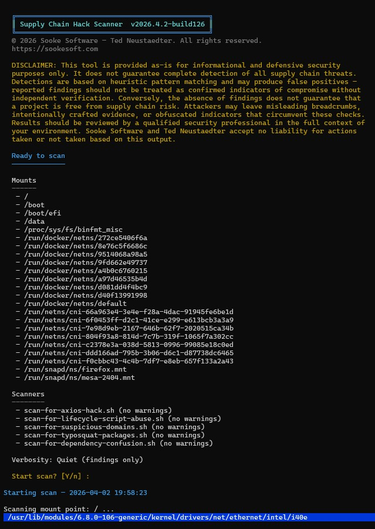

# Supply Chain Hack Scanner

© 2026 Sooke Software — Ted Neustaedter. Licensed under GNU GPL v3.0 or later.

> **DISCLAIMER:** This tool is provided as-is for informational and defensive security purposes only. It does not guarantee complete detection of all supply chain threats. Results should be reviewed by a qualified professional. Sooke Software and Ted Neustaedter accept no liability for actions taken or not taken based on this output.

---

A cross-platform (PowerShell + Bash) scanner that recursively walks every local drive or mount point and calls pluggable scanner scripts against each folder to detect supply chain compromise indicators in Node.js/Bower project files.

Why was this written in powershell and bash scripts instead of python, rust or something 
like that?  I'll give you one guess, look at the requirements, the only requirements to run
them are powershell for Windows, and bash + jq for Linux/macOS. Very low supply-chain risk.  LOL  Ya it's a bit of a nuisance having two code bases, but the tradeoff kinda makes sense
given the purpose of the tool  :)

## Features

- Scans every local drive (Windows) or mount point (Linux/macOS)
- Pluggable scanner architecture — drop a new scanner script into `scanners/` and register it
- Live progress overlay showing the current folder being scanned (blue bar)
- Immediate per-file console output — green ✓ / yellow ⚠ / red ✗ as findings are found
- Full findings table and per-drive/mount summary at completion
- Optional JSON report output

## Requirements

| Platform | Requirement |
|---|---|
| Windows | PowerShell 5.1+ or PowerShell 7+ (pwsh) |
| Linux / macOS | bash 4+, [jq](https://jqlang.github.io/jq/) |

> **macOS note:** The system bash is version 3. Install a modern bash with `brew install bash` and invoke the script explicitly: `bash scan-system.sh`

## Usage

### PowerShell (Windows)

```powershell
# Basic scan (all fixed/internal drives)
.\scan-system.ps1

# Include removable drives (USB etc.)
.\scan-system.ps1 -IncludeRemovableDrives

# Skip network drives
.\scan-system.ps1 -SkipNetworkDrives

# Write a JSON report
.\scan-system.ps1 -OutputJson C:\reports\scan-results.json
```

### Bash (Linux / macOS)

```bash
# Make executable (first time only)
chmod +x scan-system.sh scanners/scan-for-axios-hack.sh

# Basic scan
./scan-system.sh

# Skip network mounts
./scan-system.sh --skip-network

# Write a JSON report
./scan-system.sh --output-json /tmp/scan-results.json
```

## Interactive UI

When run without explicit scanner or target-selection arguments, both entry points open an interactive terminal UI so you can choose:

- which scanners to run
- which drives or mount points to scan
- the verbosity level
- whether to write a JSON report
- which selected scanners should suppress console warnings

### PowerShell interactive flow


### Bash interactive flow



## Output

While scanning, the overlay bar shows the current folder. The console only prints output when a file worth reporting is found:

```
Scanning drive C: (Windows) ...
  Scanning: C:\projects\myapp\package.json  ✓
  Scanning: C:\projects\bad\package.json  ✗
    ⚠ Declared known malicious axios version/range
  Scanning: C:\projects\other\package.json  ⚠
    ⚠ Contains postinstall script — requires manual inspection
      scripts.postinstall (line 8): node ./scripts/setup.js
```

At the end, a findings table and per-drive summary are shown:

```
Findings
========
Severity  Drive  Scanner                   Package  Version  Indicator                             Path
...

Per-drive summary
=================
Folders scanned: 48312

Drive  Folders  High  Medium  Info  Total  Status
C:     48312    1     2       5     8      ATTENTION NEEDED
```

## Scanners

Scanners live in the `scanners/` directory. Each scanner:

- Receives a single folder path as its only argument
- Does **not** recurse — `scan-system` handles all recursion
- Returns findings (PS1: objects to the pipeline; SH: JSONL to stdout)
- Exists in both PowerShell and Bash variants so the Windows and Linux/macOS drivers provide the same scanner types

### scan-for-axios-hack

Detects the [axios supply chain compromise](https://socket.dev/blog/supply-chain-attack-axios) and related indicators:

| Check | Severity | Files |
|---|---|---|
| Suspicious domain reference (`sfrclak.com`) | HIGH | all |
| Reference to `plain-crypto-js` package | HIGH | all |
| Reference to known malicious axios version in text | HIGH | all |
| Declared malicious axios version (1.14.1, 0.30.4) | HIGH | package.json, bower.json |
| Lockfile resolves to malicious axios version | HIGH | package-lock.json |
| Declared malicious plain-crypto-js version (4.2.1) | HIGH | package.json, bower.json, package-lock.json |
| `postinstall` script present | Medium | package.json |
| Any axios dependency declared | Info | package.json, bower.json, package-lock.json |

### scan-for-lifecycle-script-abuse

Inspects `package.json` lifecycle hooks for suspicious install-time behavior. It checks `preinstall`, `install`, `postinstall`, `prepare`, and `prepublishOnly` scripts.

| Check Type | Severity | Notes |
|---|---|---|
| Lifecycle hook present with no suspicious patterns | Info | Still worth reviewing because install hooks execute automatically |
| One medium-risk pattern | Medium | Examples: shell launchers, `curl`, `wget`, `npm exec`, `npx`, generic URL use |
| Any high-risk pattern | HIGH | Examples: `eval`, Base64 decoding, LOLBins, hidden execution flags, webhook/bot endpoints |
| Multiple medium-risk patterns combined | HIGH | Escalates when several suspicious behaviors appear together |

Examples of the patterns it looks for include shell execution, web download utilities, PowerShell web requests, suspicious Windows binaries, obfuscation helpers, child process spawning, hidden execution, and hard-coded exfiltration endpoints such as Discord webhooks or Telegram bot URLs.

### scan-for-suspicious-domains

Scans files in the current folder for suspicious outbound destinations and exfiltration patterns. It inspects common project files such as `package.json`, lockfiles, `.npmrc`, `.env*`, Docker files, and script/source files including `.js`, `.ts`, `.sh`, `.bat`, and `.ps1`.

| Detection Group | Severity | Notes |
|---|---|---|
| Known suspicious endpoint only | Medium or HIGH | Includes webhook, callback, tunnel, paste, and raw IP destinations |
| Exfiltration command only | Medium | Examples: `curl -X POST`, `wget --post-data`, `Invoke-RestMethod -Method Post`, `requests.post()`, `axios.post()` |
| Endpoint plus sensitive context | HIGH | Escalates when suspicious destinations are combined with env var, token, or credential access |
| Exfiltration command plus endpoint | HIGH | Stronger evidence of malicious outbound behavior |
| Sensitive context only | No finding | Avoids noisy results for normal `.env` or token handling without outbound signal |

Notable endpoints include Discord webhooks, Telegram URLs, `webhook.site`, `ngrok`, `requestbin`-style collectors, `interact.sh`, Pastebin-like services, and raw IP address URLs.

### scan-for-typosquat-packages

Looks for dependency names that appear to impersonate popular packages across multiple ecosystems. It inspects package manifests and lockfiles including npm, Python, Go, Rust, and Ruby dependency formats.

| Signal | Typical Severity | Notes |
|---|---|---|
| Suspicious publisher scope lookalike | HIGH | Examples: fake scopes resembling major vendors or ecosystems |
| One-character typo or adjacent transposition | HIGH | High-confidence package impersonation |
| Two-character similarity or separator collision | Medium | Examples: `react_dom` vs `react-dom`, `dot-env` vs `dotenv` |
| Bait-word package names | Medium | Examples: names using words like `official`, `secure`, `verified`, `patched` near a known package |
| Multiple independent signals | HIGH | Escalates when a package matches more than one suspicious pattern |

The scanner also looks for prefix/suffix impersonation and doubled-letter variants such as package names designed to resemble well-known libraries with minor edits.

### scan-for-dependency-confusion

Searches for local signs that a project may be exposed to dependency confusion. It focuses on internal-looking package names and whether the project is properly pinned to private registries.

| Check | Typical Severity | Notes |
|---|---|---|
| Internal-looking dependency name with weak private-feed evidence | Medium or HIGH | Uses naming cues such as `internal`, `corp`, `platform`, `auth`, `sdk`, `service`, `agent` |
| Suspicious dependency seen in both a manifest and a lockfile | Higher confidence | Cross-file confirmation increases severity |
| Missing npm scoped registry pin or missing global registry override | Medium or HIGH | Flags projects that appear to rely on private packages without clear registry protection |
| Python public-fallback configuration | Medium or HIGH | Detects `extra-index-url` style fallback behavior |
| Positive private-feed configuration evidence | Lower risk context | `.npmrc`, `.pypirc`, `pip.conf`, CI files, Docker files, and feed-related env vars are considered |

This scanner covers a broad set of ecosystems and file types, including npm (`package.json`, `package-lock.json`, `yarn.lock`, `pnpm-lock.yaml`), Python (`requirements.txt`, `pyproject.toml`, `Pipfile`, `poetry.lock`, `setup.py`), Go (`go.mod`), Rust (`Cargo.toml`), Ruby (`Gemfile`), .NET (`packages.config`, `Directory.Packages.props`, `paket.dependencies`), and Java/Gradle manifests.

### scan-for-credential-theft-behavior

Looks for local heuristics that suggest credential harvesting, token collection, secret packaging, or likely exfiltration behavior. It focuses on project files and scripts that reference credential stores, environment secrets, archive or encode secret material, and then send or execute it.

| Detection Group | Typical Severity | Notes |
|---|---|---|
| Secret-store or secret-env references only | Info | Examples: `.npmrc`, `.pypirc`, `.netrc`, `.git-credentials`, cloud credential paths, well-known token env vars |
| Secret access plus packaging or encoding | Medium | Examples: reading secret files, enumerating env vars, archiving or Base64-encoding likely secret material |
| Secret access plus outbound transfer | HIGH | Escalates when sensitive credential access is paired with `curl`, `wget`, webhook endpoints, HTTP clients, or file-transfer utilities |
| Secret collection plus execution helpers | Medium or HIGH | Process launch, inline shell execution, or hidden execution increases confidence when combined with collection logic |
| Lifecycle/build script handling secrets suspiciously | HIGH | `package.json` lifecycle hooks and build files score higher when they combine secret access with packaging or outbound behavior |

The scanner inspects `package.json`, lockfiles, `.npmrc`, `.env*`, Docker and CI files, and common script/source file types. It also attempts to capture package name and version from `package.json` when present.

### scan-for-obfuscation-staged-loaders

Detects local indicators of obfuscation, encoded payloads, staged loaders, downloader chains, hidden execution, and temp-file staging. It is designed for triage rather than definitive malware classification, using weighted signals and severity escalation when strong combinations occur in the same file.

| Detection Group | Typical Severity | Notes |
|---|---|---|
| Encoded or packed payload markers | Info or Medium | Examples: Base64 decode helpers, `atob`, `Buffer.from(..., base64)`, `certutil -decode`, `powershell -enc`, long Base64 or hex blobs |
| Dynamic or reflective execution | Medium | Examples: `eval`, `new Function`, `Invoke-Expression`, `exec`, `spawn`, `child_process`, `os.system`, `Process.Start`, `bash -c`, `python -c` |
| Downloader or remote script execution | HIGH | Examples: `curl` or `wget` piped into a shell, `Invoke-WebRequest ... | iex`, fetch or request responses executed immediately |
| Temp-file staging plus execution | Medium or HIGH | Examples: writes to `/tmp`, `%TEMP%`, or `AppData\Local\Temp`, followed by `chmod +x`, rename, move, or launch behavior |
| Hidden or stealthy execution | Medium or HIGH | Examples: hidden window flags, detached background launch, persistence helpers, or stealth wording combined with execution or download behavior |
| Rebuilt commands, URLs, or staged-flow wording | Info or Medium | Examples: fragmented string assembly, array joins, disguised `hxxp` URLs, `loader`, `stager`, `bootstrap`, `payload`, or `stage1/stage2` terms |

The scanner covers `package.json`, lockfiles, `.npmrc`, `.env*`, Docker and build files, and a broad set of script and source extensions including JavaScript, TypeScript, Python, shell, PowerShell, .NET, Go, YAML, and JSON. Severity increases when encoding, dynamic execution, downloader logic, staging, or hidden execution appear together in the same file.

### scan-for-vscode-extension-risks

Detects local heuristics that suggest a folder is a VS Code or Open VSX extension with suspicious activation, risky lifecycle scripts, broad workspace interaction, credential access, outbound behavior, persistence-style activity, or suspicious packaging clues. The scanner is intentionally conservative when a folder does not clearly look like an extension project.

| Detection Group | Typical Severity | Notes |
|---|---|---|
| Extension manifest markers only | Info | Looks for `engines.vscode`, `activationEvents`, `contributes`, `main`, `publisher`, `displayName`, `extensionKind`, `capabilities`, and related extension metadata |
| Broad or eager activation | Info or Medium | Examples: `*`, `onStartupFinished`, workspace-wide activation patterns, or many activation events combined |
| Lifecycle script abuse in extension builds | Medium or HIGH | Flags `preinstall`, `install`, `postinstall`, `prepare`, `prepublishOnly`, `vscode:prepublish`, `compile`, `watch`, and `package` when they include downloaders, encoded shell launches, inline commands, LOLBins, or webhook endpoints |
| Extension API use plus network or secret access | Medium or HIGH | Examples: `vscode.workspace.findFiles`, `vscode.workspace.fs`, `vscode.commands.executeCommand`, terminal automation, outbound requests, secret-store paths, or environment token access in the same file |
| Credential harvesting or exfiltration behavior | HIGH | Escalates when workspace or user-profile access combines with outbound logic, storage inspection, token collection, or suspicious endpoints |
| Obfuscation, staged execution, or suspicious packaging clues | Medium or HIGH | Examples: Base64 helpers, `eval`, child-process execution, encoded blobs, bundled executables, or `.vscodeignore` exclusion patterns that may reduce package review visibility |

The scanner inspects extension-adjacent files in the current folder only, including `package.json`, lockfiles, entry-point files such as `extension.js` or `main.ts`, common script and source files, configuration files, `.vscodeignore`, `.npmrc`, `.env*`, `README.md`, `CHANGELOG.md`, and `LICENSE`. It uses weighted scoring so combinations like broad activation plus risky scripts, or VS Code API access plus credential and outbound behavior, raise severity.

## Adding a New Scanner

1. Create `scanners/my-scanner.ps1` (and/or `scanners/my-scanner.sh`)
2. Accept a single `-ScanPath` parameter (PS1) or positional `$1` argument (SH)
3. Do not recurse into subfolders
4. Output findings (PS1: `[pscustomobject]` with the fields below; SH: JSONL with the same fields as lowercase keys)
5. Register it in `scan-system.ps1` by adding to `$ScannerScripts`, and in `scan-system.sh` by adding to `SCANNER_SCRIPTS`

**Finding fields:** `Severity` (HIGH / Medium / Info), `Type`, `Path`, `PackageName`, `Version`, `Indicator`, `Evidence`, `Recommendation`

## License

This project is licensed under the GNU General Public License, version 3 or any later version. See [LICENSE](LICENSE).
