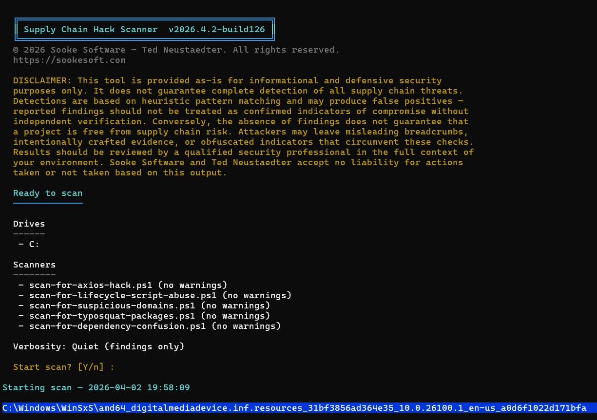
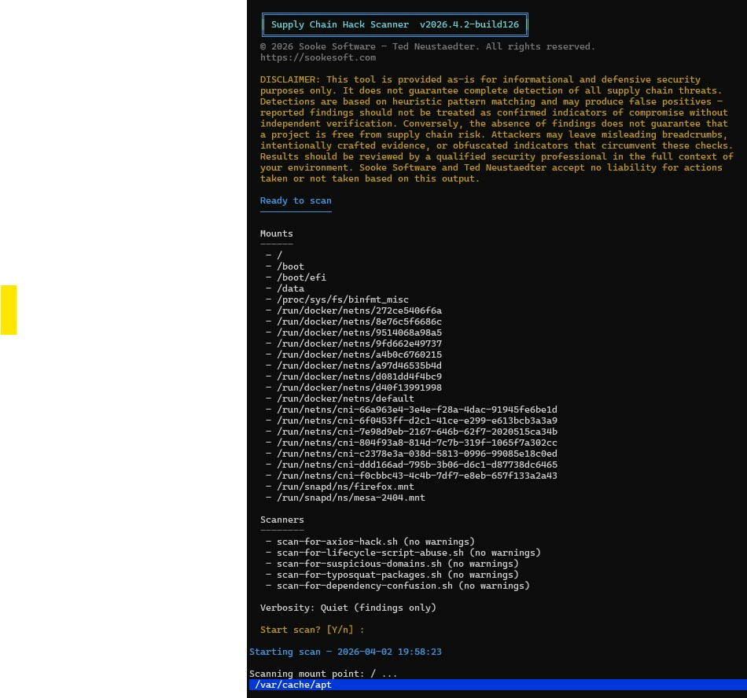

# Supply Chain Hack Scanner

© 2026 Sooke Software — Ted Neustaedter. All rights reserved.

> **DISCLAIMER:** This tool is provided as-is for informational and defensive security purposes only. It does not guarantee complete detection of all supply chain threats. Results should be reviewed by a qualified professional. Sooke Software and Ted Neustaedter accept no liability for actions taken or not taken based on this output.

---

A cross-platform (PowerShell + Bash) scanner that recursively walks every local drive or mount point and calls pluggable scanner scripts against each folder to detect supply chain compromise indicators in Node.js/Bower project files.

Why was this written in powershell and bash scripts instead of python, rust or something 
like that?  I'll give you one guess, look at the requirements, the only requirements to run
them are powershell for Windows, and bash + jq for Linux/macOS. Very low supply-chain risk.  LOL  Ya it's a bit of a nuisance having two code bases, but the tradeoff kinda makes sense
given the purpose of the tool  :)

## Features

- Scans every local drive (Windows) or mount point (Linux/macOS)
- Pluggable scanner architecture — drop a new scanner script into `scanners/` and register it
- Live progress overlay showing the current folder being scanned (blue bar)
- Immediate per-file console output — green ✓ / yellow ⚠ / red ✗ as findings are found
- Full findings table and per-drive/mount summary at completion
- Optional JSON report output

## Requirements

| Platform | Requirement |
|---|---|
| Windows | PowerShell 5.1+ or PowerShell 7+ (pwsh) |
| Linux / macOS | bash 4+, [jq](https://jqlang.github.io/jq/) |

> **macOS note:** The system bash is version 3. Install a modern bash with `brew install bash` and invoke the script explicitly: `bash scan-system.sh`

## Usage

### PowerShell (Windows)

```powershell
# Basic scan (all fixed/internal drives)
.\scan-system.ps1

# Include removable drives (USB etc.)
.\scan-system.ps1 -IncludeRemovableDrives

# Skip network drives
.\scan-system.ps1 -SkipNetworkDrives

# Write a JSON report
.\scan-system.ps1 -OutputJson C:\reports\scan-results.json
```

### Bash (Linux / macOS)

```bash
# Make executable (first time only)
chmod +x scan-system.sh scanners/scan-for-axios-hack.sh

# Basic scan
./scan-system.sh

# Skip network mounts
./scan-system.sh --skip-network

# Write a JSON report
./scan-system.sh --output-json /tmp/scan-results.json
```

## Interactive UI

When run without explicit scanner or target-selection arguments, both entry points open an interactive terminal UI so you can choose:

- which scanners to run
- which drives or mount points to scan
- the verbosity level
- whether to write a JSON report
- which selected scanners should suppress console warnings

### PowerShell interactive flow



### Bash interactive flow



## Output

While scanning, the overlay bar shows the current folder. The console only prints output when a file worth reporting is found:

```
Scanning drive C: (Windows) ...
  Scanning: C:\projects\myapp\package.json  ✓
  Scanning: C:\projects\bad\package.json  ✗
    ⚠ Declared known malicious axios version/range
  Scanning: C:\projects\other\package.json  ⚠
    ⚠ Contains postinstall script — requires manual inspection
      scripts.postinstall (line 8): node ./scripts/setup.js
```

At the end, a findings table and per-drive summary are shown:

```
Findings
========
Severity  Drive  Scanner                   Package  Version  Indicator                             Path
...

Per-drive summary
=================
Folders scanned: 48312

Drive  Folders  High  Medium  Info  Total  Status
C:     48312    1     2       5     8      ATTENTION NEEDED
```

## Scanners

Scanners live in the `scanners/` directory. Each scanner:

- Receives a single folder path as its only argument
- Does **not** recurse — `scan-system` handles all recursion
- Returns findings (PS1: objects to the pipeline; SH: JSONL to stdout)

### scan-for-axios-hack

Detects the [axios supply chain compromise](https://socket.dev/blog/supply-chain-attack-axios) and related indicators:

| Check | Severity | Files |
|---|---|---|
| Suspicious domain reference (`sfrclak.com`) | HIGH | all |
| Reference to `plain-crypto-js` package | HIGH | all |
| Reference to known malicious axios version in text | HIGH | all |
| Declared malicious axios version (1.14.1, 0.30.4) | HIGH | package.json, bower.json |
| Lockfile resolves to malicious axios version | HIGH | package-lock.json |
| Declared malicious plain-crypto-js version (4.2.1) | HIGH | package.json, bower.json, package-lock.json |
| `postinstall` script present | Medium | package.json |
| Any axios dependency declared | Info | package.json, bower.json, package-lock.json |

## Adding a New Scanner

1. Create `scanners/my-scanner.ps1` (and/or `scanners/my-scanner.sh`)
2. Accept a single `-ScanPath` parameter (PS1) or positional `$1` argument (SH)
3. Do not recurse into subfolders
4. Output findings (PS1: `[pscustomobject]` with the fields below; SH: JSONL with the same fields as lowercase keys)
5. Register it in `scan-system.ps1` by adding to `$ScannerScripts`, and in `scan-system.sh` by adding to `SCANNER_SCRIPTS`

**Finding fields:** `Severity` (HIGH / Medium / Info), `Type`, `Path`, `PackageName`, `Version`, `Indicator`, `Evidence`, `Recommendation`

## License

© 2026 Sooke Software — Ted Neustaedter. All rights reserved.
